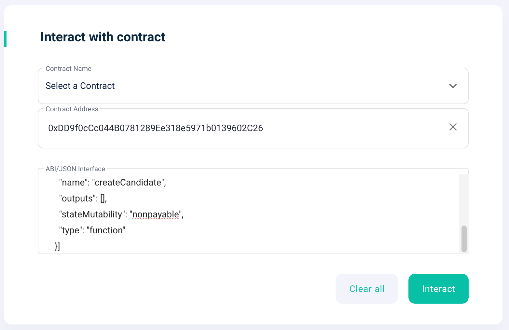
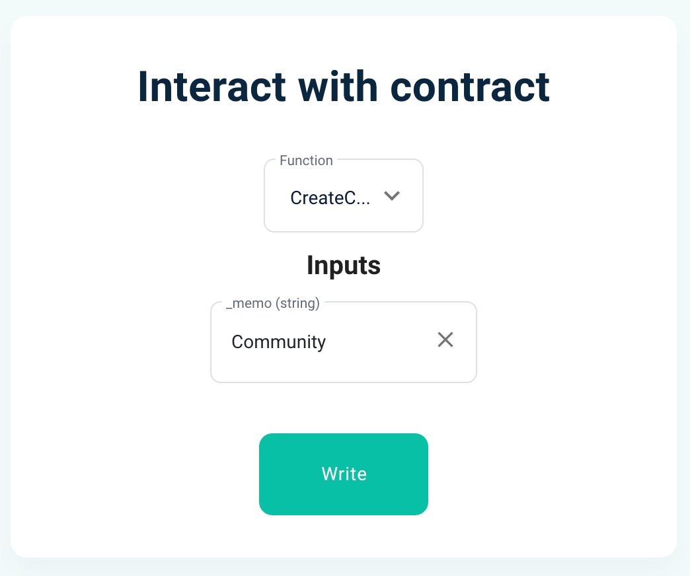

# Register as a DAO Candidate
> Here is the function to register a candidate.
> Anyone can register as a Candidate.


## DAOCommitteeProxy: [etherscan link](https://etherscan.io/address/0xDD9f0cCc044B0781289Ee318e5971b0139602C26#writeProxyContract)

---

### createCandidate(string calldata _memo)

A function that registers a candidate.
The DAO committee function consists of multiple logic elements. The logic contained within this function is not visible on Etherscan, so you must call the contract function directly using the ABI, as in [MyEtherWallet](https://www.myetherwallet.com/wallet/interact).


- Parameters
    - Contract Address : 0xDD9f0cCc044B0781289Ee318e5971b0139602C26
    - ABI
    ```
    [{
      "inputs": [
        {
          "internalType": "string",
          "name": "_memo",
          "type": "string"
        }
      ],
      "name": "createCandidate",
      "outputs": [],
      "stateMutability": "nonpayable",
      "type": "function"
    }]
    ```
    - _memo : Content that can represent a candidate

- Execute : Click the Write button




*********
