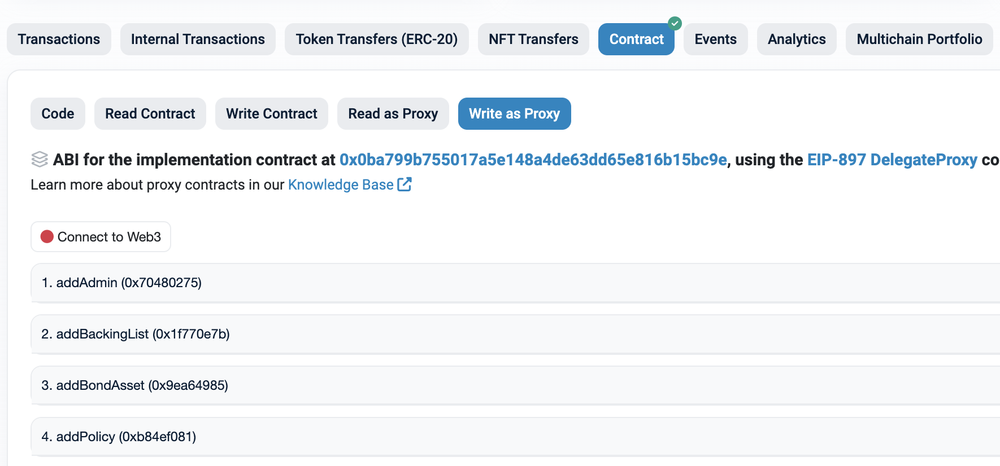

# Contract interaction using Etherscan

> You can connect your wallet on Etherscan and call contract functions.

Read-only functions can be used on the Read Contract or Read as Proxy pages, and state-changing functions can be called on the Write Contract or Write as Proxy pages.

## Read calls
On the contract's Read Contract or Read as Proxy page, you can see the available view functions. Enter the parameters according to the function interface and click the query button to see the result.

If parameters are required for a read call, an input area like the following will appear. Enter parameters and click the query button to execute the read.
||
|:--:|

## Write transactions

To execute a transaction, connect your wallet first (top-right of the page).
On the contract's Write Contract or Write as Proxy page, you can see the available state-changing functions. Enter the parameters according to the interface and click the 'Write' button to send the transaction.

If parameters are required for a transaction, an input area like the following will appear. Enter parameters and click the Write button to submit the transaction.
||
|:--:|

