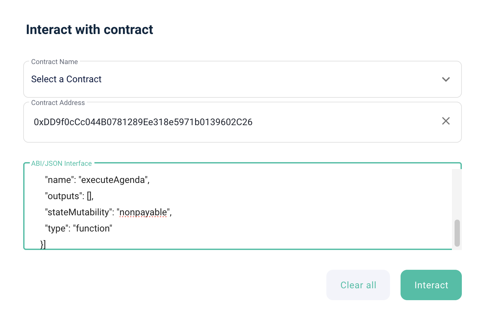
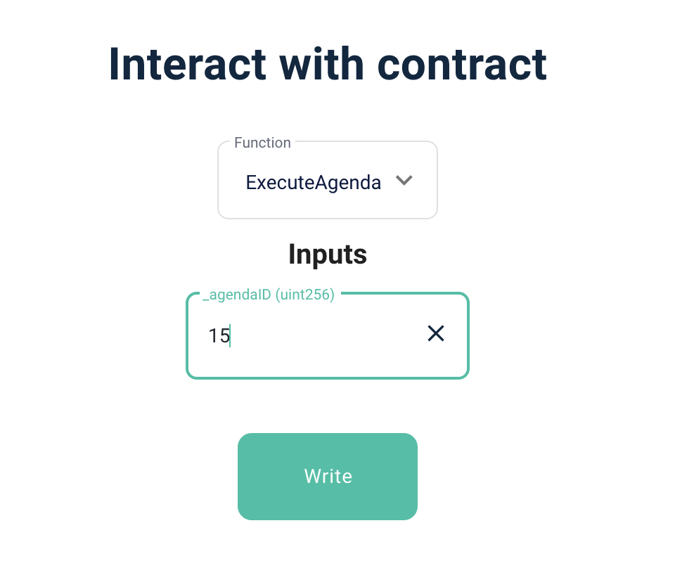

# 아젠다 실행하기
> 아젠다를 실행하기 위한 함수를 안내합니다.
> 투표를 통해 통과된 아젠다이면 누구나 실행이 가능합니다.


## DAOAgendaManager: [etherscan link](https://etherscan.io/address/0xcD4421d082752f363E1687544a09d5112cD4f484#code)

---

### [canExecuteAgenda(uint256 _agendaID)](https://etherscan.io/address/0xcD4421d082752f363E1687544a09d5112cD4f484#readContract#F2)

아젠다 실행 가능한 상태인지 여부

- 파라미터
  - uint256 _agendaID: 조회할 아젠다 인덱스
- 결과
  - bool: true 이면 실행 가능한 상태, false 이면 실행 불가능한 상태

*********


## DAOCommitteeProxy: [etherscan link](https://etherscan.io/address/0xDD9f0cCc044B0781289Ee318e5971b0139602C26#writeProxyContract)
---


*********

### executeAgenda(uint256 _agendaID)

아젠다를 실행하는 함수.
다오 커미티함수는 여러개의 로직으로 구성되어 있습니다. 이 함수가 포함된 로직은 이더스캔에서 표시되지 않으므로, [마이이더월렛](https://www.myetherwallet.com/wallet/interact) 과 같이 직접 ABI를 이용하여 컨트랙 함수를 호출해야 합니다.


- 파라미터
    - 컨트랙 주소 : 0xDD9f0cCc044B0781289Ee318e5971b0139602C26
    - ABI
    ```
    [{
      "inputs": [
        {
          "internalType": "uint256",
          "name": "_agendaID",
          "type": "uint256"
        }
      ],
      "name": "executeAgenda",
      "outputs": [],
      "stateMutability": "nonpayable",
      "type": "function"
    }]
    ```
    - _agendaID : 실행할 아젠다 인덱스

- 실행 : Write 버튼 클릭




*********

